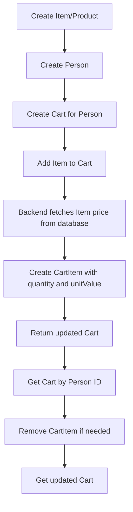

# Delivery API — Cart Flow Lab

Projeto de laboratório para praticar modelagem de domínio, criação de API REST, persistência com JPA/Hibernate e fluxo de carrinho em uma aplicação de delivery.

Este projeto faz parte de uma sequência maior de estudos em **System Design**, com foco inicial em uma aplicação simples rodando localmente. A ideia é evoluir gradualmente para cenários mais próximos de produção, como separação de banco, cache, mensageria, observabilidade, balanceamento de carga e, posteriormente, migração para cloud.

---

## Objetivo do projeto

O objetivo deste módulo é implementar um fluxo básico de delivery:

1. Cadastrar produtos disponíveis no catálogo.
2. Cadastrar uma pessoa/cliente.
3. Criar um carrinho para essa pessoa.
4. Adicionar produtos existentes ao carrinho.
5. Consultar o carrinho com os itens adicionados.
6. Remover itens do carrinho.

A regra principal é: **o frontend não envia o preço do produto ao adicionar no carrinho**.  
O backend recebe apenas o `itemId` e a `quantity`, busca o preço oficial no banco e grava esse valor no item do carrinho.

---

## Tecnologias utilizadas

- Java
- Spring Boot
- Spring Web
- Spring Data JPA
- Hibernate
- H2 Database
- Maven
- Postman/Insomnia para testes

---

## Modelo de domínio

A modelagem principal segue a estrutura:

```text
Person 1 --- 1 Cart
Cart   1 --- N CartItem
CartItem N --- 1 Item
```

### Entidades

#### `Person`

Representa o cliente da aplicação.

Responsabilidades:

- Armazenar dados pessoais básicos.
- Armazenar dados de endereço.
- Possuir um único carrinho ativo.

Exemplo conceitual:

```text
Person
- id
- name
- age
- document
- zipCode
- street
- number
- complement
- neighborhood
- city
- state
- cart
```

---

#### `Item`

Representa um produto disponível no catálogo.

Responsabilidades:

- Armazenar SKU.
- Armazenar nome do produto.
- Armazenar preço atual do produto.

Exemplo conceitual:

```text
Item
- id
- sku
- name
- unitPrice
```

Importante: `Item` não representa um produto dentro do carrinho.  
Ele representa o produto cadastrado no catálogo.

---

#### `Cart`

Representa o carrinho de uma pessoa.

Responsabilidades:

- Pertencer a uma pessoa.
- Agrupar vários `CartItem`.
- Calcular o valor total do carrinho.

Exemplo conceitual:

```text
Cart
- id
- person
- items
- totalValue
```

---

#### `CartItem`

Representa uma linha dentro do carrinho.

Responsabilidades:

- Apontar para um produto do catálogo.
- Armazenar a quantidade escolhida.
- Armazenar o preço unitário usado no momento da inclusão.
- Calcular o total daquela linha.

Exemplo conceitual:

```text
CartItem
- id
- item
- quantity
- unitValue
- totalValue
```

### Por que `CartItem` tem `unitValue`?

O `Item` possui o preço atual do produto, por exemplo:

```text
Burger Artesanal = R$ 29,90
```

Quando esse produto é adicionado ao carrinho, o backend copia esse preço para `CartItem.unitValue`.

Isso permite preservar o valor utilizado naquele momento. Se o preço do produto mudar depois, o item já adicionado ao carrinho não muda automaticamente.

---

## Fluxo da regra de negócio

O fluxo recomendado é:

```text
1. Criar produtos no catálogo.
2. Criar uma pessoa.
3. Criar um carrinho para essa pessoa.
4. Adicionar produtos existentes ao carrinho.
5. Consultar o carrinho.
6. Remover um item do carrinho, se necessário.
7. Consultar novamente o carrinho.
```

A ordem entre criar `Person` e criar `Item` não importa no início, porque uma entidade ainda não depende da outra.

Porém, para adicionar produtos ao carrinho, é necessário que:

- A pessoa já exista.
- O produto já exista.
- A pessoa tenha um carrinho ou o backend crie um automaticamente.

---

## Endpoints disponíveis

| Método | Endpoint | Descrição |
|---|---|---|
| `POST` | `/api/v1/items` | Cria um produto |
| `GET` | `/api/v1/items` | Lista produtos |
| `GET` | `/api/v1/items/{id}` | Busca produto por ID |
| `POST` | `/api/v1/persons` | Cria uma pessoa |
| `GET` | `/api/v1/persons` | Lista pessoas |
| `GET` | `/api/v1/persons/{id}` | Busca pessoa por ID |
| `POST` | `/api/v1/carts/persons/{personId}` | Cria carrinho para uma pessoa |
| `GET` | `/api/v1/carts/persons/{personId}` | Consulta carrinho da pessoa |
| `POST` | `/api/v1/carts/persons/{personId}/items` | Adiciona item ao carrinho |
| `DELETE` | `/api/v1/carts/persons/{personId}/items/{cartItemId}` | Remove item do carrinho |

---

## Como testar no Postman

Base URL:

```text
http://localhost:8080
```

---

# 1. Criar produto 1

```http
POST http://localhost:8080/api/v1/items
Content-Type: application/json
```

```json
{
  "sku": "BURGER-001",
  "name": "Burger Artesanal",
  "unitPrice": 29.90
}
```

---

# 2. Criar produto 2

```http
POST http://localhost:8080/api/v1/items
Content-Type: application/json
```

```json
{
  "sku": "FRIES-001",
  "name": "Batata Frita",
  "unitPrice": 14.90
}
```

---

# 3. Criar produto 3

```http
POST http://localhost:8080/api/v1/items
Content-Type: application/json
```

```json
{
  "sku": "SODA-001",
  "name": "Refrigerante Lata",
  "unitPrice": 7.50
}
```

---

# 4. Conferir produtos criados

```http
GET http://localhost:8080/api/v1/items
```

Resposta esperada aproximada:

```json
[
  {
    "id": 1,
    "sku": "BURGER-001",
    "name": "Burger Artesanal",
    "unitPrice": 29.90
  },
  {
    "id": 2,
    "sku": "FRIES-001",
    "name": "Batata Frita",
    "unitPrice": 14.90
  },
  {
    "id": 3,
    "sku": "SODA-001",
    "name": "Refrigerante Lata",
    "unitPrice": 7.50
  }
]
```

---

# 5. Criar pessoa

```http
POST http://localhost:8080/api/v1/persons
Content-Type: application/json
```

```json
{
  "name": "Felipe Matheus",
  "age": 25,
  "document": "12345678909",
  "zipCode": "01001-000",
  "street": "Rua Exemplo",
  "number": 100,
  "complement": "Apartamento 202",
  "neighborhood": "Centro",
  "city": "São Paulo",
  "state": "SP"
}
```

---

# 6. Conferir pessoa criada

```http
GET http://localhost:8080/api/v1/persons
```

Resposta esperada aproximada:

```json
[
  {
    "id": 1,
    "name": "Felipe Matheus",
    "age": 25,
    "document": "12345678909",
    "zipCode": "01001-000",
    "street": "Rua Exemplo",
    "number": 100,
    "complement": "Apartamento 202",
    "neighborhood": "Centro",
    "city": "São Paulo",
    "state": "SP",
    "cart": null
  }
]
```

---

# 7. Criar carrinho para a pessoa

```http
POST http://localhost:8080/api/v1/carts/persons/1
Content-Type: application/json
```

Não precisa enviar body.

Regra executada:

```text
1. Busca a pessoa pelo personId.
2. Verifica se ela já possui carrinho.
3. Se não possuir, cria um novo carrinho.
4. Associa o carrinho à pessoa.
5. Salva a alteração.
```

---

# 8. Adicionar Burger ao carrinho

```http
POST http://localhost:8080/api/v1/carts/persons/1/items
Content-Type: application/json
```

```json
{
  "itemId": 1,
  "quantity": 2
}
```

Regra executada:

```text
1. Busca a pessoa pelo personId.
2. Busca o carrinho da pessoa.
3. Busca o produto pelo itemId.
4. Cria um CartItem.
5. Define quantity = 2.
6. Copia Item.unitPrice para CartItem.unitValue.
7. Adiciona o CartItem ao Cart.
8. Salva o carrinho atualizado.
```

---

# 9. Adicionar Batata ao carrinho

```http
POST http://localhost:8080/api/v1/carts/persons/1/items
Content-Type: application/json
```

```json
{
  "itemId": 2,
  "quantity": 1
}
```

---

# 10. Adicionar Refrigerante ao carrinho

```http
POST http://localhost:8080/api/v1/carts/persons/1/items
Content-Type: application/json
```

```json
{
  "itemId": 3,
  "quantity": 2
}
```

---

# 11. Consultar carrinho da pessoa

```http
GET http://localhost:8080/api/v1/carts/persons/1
```

Resposta esperada aproximada:

```json
{
  "id": 1,
  "items": [
    {
      "id": 1,
      "quantity": 2,
      "unitValue": 29.90,
      "item": {
        "id": 1,
        "sku": "BURGER-001",
        "name": "Burger Artesanal",
        "unitPrice": 29.90
      },
      "totalValue": 59.80
    },
    {
      "id": 2,
      "quantity": 1,
      "unitValue": 14.90,
      "item": {
        "id": 2,
        "sku": "FRIES-001",
        "name": "Batata Frita",
        "unitPrice": 14.90
      },
      "totalValue": 14.90
    },
    {
      "id": 3,
      "quantity": 2,
      "unitValue": 7.50,
      "item": {
        "id": 3,
        "sku": "SODA-001",
        "name": "Refrigerante Lata",
        "unitPrice": 7.50
      },
      "totalValue": 15.00
    }
  ],
  "totalValue": 89.70
}
```

---

# 12. Remover um item do carrinho

Para remover um item, use o `id` do `CartItem`, não o `itemId`.

Exemplo: no retorno acima, a Batata Frita está no `CartItem` de ID `2`.

```http
DELETE http://localhost:8080/api/v1/carts/persons/1/items/2
```

Não precisa enviar body.

---

# 13. Consultar novamente o carrinho

```http
GET http://localhost:8080/api/v1/carts/persons/1
```

Agora o carrinho deve retornar sem a Batata Frita.

Resposta esperada aproximada:

```json
{
  "id": 1,
  "items": [
    {
      "id": 1,
      "quantity": 2,
      "unitValue": 29.90,
      "item": {
        "id": 1,
        "sku": "BURGER-001",
        "name": "Burger Artesanal",
        "unitPrice": 29.90
      },
      "totalValue": 59.80
    },
    {
      "id": 3,
      "quantity": 2,
      "unitValue": 7.50,
      "item": {
        "id": 3,
        "sku": "SODA-001",
        "name": "Refrigerante Lata",
        "unitPrice": 7.50
      },
      "totalValue": 15.00
    }
  ],
  "totalValue": 74.80
}
```

---

## Ordem resumida de testes

```text
1.  POST   /api/v1/items
2.  POST   /api/v1/items
3.  POST   /api/v1/items
4.  GET    /api/v1/items

5.  POST   /api/v1/persons
6.  GET    /api/v1/persons

7.  POST   /api/v1/carts/persons/1

8.  POST   /api/v1/carts/persons/1/items
9.  POST   /api/v1/carts/persons/1/items
10. POST   /api/v1/carts/persons/1/items

11. GET    /api/v1/carts/persons/1

12. DELETE /api/v1/carts/persons/1/items/2

13. GET    /api/v1/carts/persons/1
```

---

## Exemplo de fluxo em alto nível



---

## Regras de negócio principais

- Uma `Person` pode ter no máximo um `Cart` ativo.
- Um `Cart` pode ter vários `CartItem`.
- Um `CartItem` aponta para um `Item` existente.
- O frontend não informa preço ao adicionar produto ao carrinho.
- O backend busca o preço real do produto no banco.
- O `CartItem.unitValue` guarda o preço usado no momento da inclusão.
- O total de cada item é calculado por `quantity * unitValue`.
- O total do carrinho é a soma dos totais de todos os `CartItem`.

---

## Próximos passos possíveis

Este módulo pode evoluir para cenários mais avançados, como:

- Criar DTOs de response para não retornar entidades JPA diretamente.
- Criar tratamento global de exceções com `@ControllerAdvice`.
- Adicionar validações com Bean Validation.
- Criar entidade `Order` para transformar carrinho em pedido.
- Adicionar entidade `Payment`.
- Adicionar autenticação.
- Trocar H2 por PostgreSQL.
- Dockerizar a aplicação.
- Separar aplicação e banco em containers diferentes.
- Evoluir para arquitetura com Load Balancer, Cache e Message Queue.
- Migrar o laboratório para AWS como parte da trilha de System Design.

---

## Observação

Este projeto ainda é um laboratório inicial. O foco principal aqui é entender bem:

```text
Produto não é item de carrinho.
Carrinho não é produto.
Pessoa não tem produto diretamente.
Pessoa tem carrinho.
Carrinho tem linhas.
Cada linha aponta para um produto.
```
