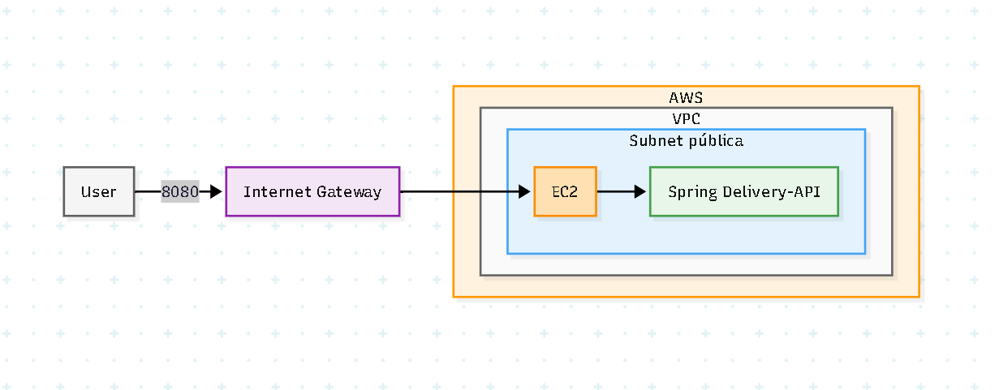

# 01 — Single Server na AWS com EC2, Internet Gateway e Docker

> Laboratório inicial de System Design para publicar uma API Spring Boot em uma EC2 dentro de uma subnet pública, usando Docker, Internet Gateway e Security Group.

Este módulo faz parte do repositório **system-design-lab** e representa o primeiro passo da evolução de uma aplicação local para uma arquitetura básica em cloud.

A proposta aqui não é criar uma arquitetura de produção, mas sim praticar os fundamentos de rede e deploy na AWS: **VPC, subnet pública, route table, Internet Gateway, EC2, Security Group, Docker Hub e exposição de uma API HTTP na porta 8080**.

---

## Arquitetura



### Visão geral

```text
User / Browser / Postman
        |
        | HTTP :8080
        v
Internet
        |
        v
Internet Gateway
        |
        v
VPC
 └── Subnet pública
      └── EC2
           └── Docker Container
                └── Spring Delivery API + H2 + Seeder
```

---

## Objetivo do laboratório

O objetivo deste laboratório é executar uma API Spring Boot containerizada em uma instância EC2 pública, permitindo acesso externo pela porta `8080`.

Ao final, a aplicação pode ser acessada por:

```text
http://<EC2_PUBLIC_IP>:8080
```

ou, caso o projeto tenha Swagger habilitado:

```text
http://<EC2_PUBLIC_IP>:8080/swagger-ui/index.html
```

---

## O que este laboratório pratica

Este módulo foi criado para reforçar os seguintes conceitos:

| Conceito | Papel na arquitetura |
|---|---|
| **VPC** | Rede privada isolada dentro da AWS |
| **Subnet pública** | Sub-rede com rota para a internet via Internet Gateway |
| **Internet Gateway** | Componente que permite tráfego entre a VPC e a internet |
| **Route Table** | Define para onde o tráfego da subnet deve ser roteado |
| **EC2** | Máquina virtual que hospeda o container da aplicação |
| **Security Group** | Firewall virtual que controla entrada e saída da EC2 |
| **Docker** | Empacota e executa a aplicação de forma portável |
| **Docker Hub** | Registry de onde a EC2 baixa a imagem da aplicação |
| **H2 Database** | Banco em memória usado para simplificar o laboratório |
| **Seeder** | Popula dados iniciais ao subir a aplicação |

---

## Por que esta arquitetura é pública?

Neste laboratório, a EC2 fica dentro de uma **subnet pública**.

Uma subnet é considerada pública quando a sua tabela de rotas possui uma rota como esta:

```text
0.0.0.0/0 -> Internet Gateway
```

Isso significa que o tráfego destinado à internet pode sair pelo Internet Gateway, e que recursos com IP público nessa subnet podem receber tráfego externo, desde que o Security Group permita.

Para a EC2 responder publicamente, quatro coisas precisam estar corretas:

```text
1. EC2 com Public IPv4 habilitado
2. Subnet associada a uma Route Table pública
3. Route Table com 0.0.0.0/0 apontando para o Internet Gateway
4. Security Group liberando a porta da aplicação
```

---

## Fluxo da requisição

Quando um usuário chama a API, o fluxo conceitual é:

```text
1. O usuário faz uma requisição HTTP para http://<EC2_PUBLIC_IP>:8080
2. A requisição chega pela internet
3. O Internet Gateway permite a comunicação com a VPC
4. A Route Table direciona o tráfego para a subnet pública
5. O Security Group valida se a porta 8080 está liberada
6. A EC2 recebe a requisição
7. O Docker encaminha a porta 8080 da máquina para a porta 8080 do container
8. A aplicação Spring Boot processa a requisição
9. O banco H2 responde em memória
10. A API retorna a resposta para o usuário
```

---

## Stack utilizada

### Aplicação

- Java
- Spring Boot
- Spring Web
- Spring Data JPA
- Hibernate
- H2 Database
- Maven
- Seeder de dados na inicialização

### Infraestrutura

- AWS VPC
- Public Subnet
- Internet Gateway
- Route Table
- EC2
- Security Group
- Docker
- Docker Hub

### Ferramentas de teste

- Browser
- Postman
- Insomnia
- cURL
- Swagger UI, caso habilitado

---

## Modelo de deploy

A aplicação é empacotada em uma imagem Docker e publicada no Docker Hub.

A EC2 baixa essa imagem e executa o container localmente.

```text
Código fonte
   ↓
mvn clean package
   ↓
Docker build
   ↓
Docker push
   ↓
Docker Hub
   ↓
EC2 pull
   ↓
Docker run
   ↓
API pública em :8080
```

---

## Build local da aplicação

Na raiz do projeto da aplicação Spring Boot:

```bash
mvn clean package
```

Depois, gere a imagem Docker:

```bash
docker build -t <seu-usuario-dockerhub>/spring-delivery-api:latest .
```

Teste localmente:

```bash
docker run -d \
  --name spring-delivery-api \
  -p 8080:8080 \
  <seu-usuario-dockerhub>/spring-delivery-api:latest
```

Acesse:

```text
http://localhost:8080
```

---

## Publicação no Docker Hub

Faça login:

```bash
docker login
```

Envie a imagem:

```bash
docker push <seu-usuario-dockerhub>/spring-delivery-api:latest
```

---

## Configuração sugerida na AWS

### VPC

Exemplo de CIDR:

```text
10.0.0.0/16
```

### Subnet pública

Exemplo de CIDR:

```text
10.0.1.0/24
```

A subnet deve estar associada a uma Route Table pública.

### Internet Gateway

Criar um Internet Gateway e anexar à VPC.

### Route Table pública

Rotas esperadas:

```text
Destination     Target
10.0.0.0/16     local
0.0.0.0/0       Internet Gateway
```

### EC2

Configuração recomendada para laboratório:

```text
AMI: Amazon Linux ou Ubuntu
Instance type: t2.micro / t3.micro
Subnet: pública
Public IPv4: habilitado
Security Group: liberar SSH e porta 8080
```

---

## Security Group recomendado

Para um laboratório público e simples:

| Tipo | Porta | Origem | Observação |
|---|---:|---|---|
| SSH | 22 | Seu IP/32 | Acesso administrativo à EC2 |
| Custom TCP | 8080 | 0.0.0.0/0 | Acesso público à API |

Exemplo:

```text
Inbound Rules
- TCP 22    -> Meu IP/32
- TCP 8080  -> 0.0.0.0/0
```

> Observação: deixar a porta `8080` pública é aceitável para laboratório, mas não é o padrão ideal para produção. Em uma arquitetura mais madura, normalmente a aplicação ficaria em subnet privada atrás de um Load Balancer.

---

## Instalação do Docker na EC2

### Amazon Linux

```bash
sudo yum update -y
sudo yum install docker -y
sudo systemctl enable docker
sudo systemctl start docker
sudo usermod -aG docker ec2-user
```

Saia da sessão SSH e entre novamente para aplicar o grupo `docker`.

Verifique:

```bash
docker --version
```

### Ubuntu

```bash
sudo apt update
sudo apt install docker.io -y
sudo systemctl enable docker
sudo systemctl start docker
sudo usermod -aG docker ubuntu
```

Saia da sessão SSH e entre novamente.

Verifique:

```bash
docker --version
```

---

## Executando a aplicação na EC2

Baixe a imagem:

```bash
docker pull <seu-usuario-dockerhub>/spring-delivery-api:latest
```

Execute o container:

```bash
docker run -d \
  --name spring-delivery-api \
  -p 8080:8080 \
  <seu-usuario-dockerhub>/spring-delivery-api:latest
```

Verifique se está rodando:

```bash
docker ps
```

Acompanhe os logs:

```bash
docker logs -f spring-delivery-api
```

---

## Testando a API

Substitua `<EC2_PUBLIC_IP>` pelo IP público da sua instância.

```bash
curl http://<EC2_PUBLIC_IP>:8080
```

Se existir endpoint de health:

```bash
curl http://<EC2_PUBLIC_IP>:8080/actuator/health
```

Se existir Swagger:

```text
http://<EC2_PUBLIC_IP>:8080/swagger-ui/index.html
```

---

## Banco H2 e Seeder

Este laboratório usa H2 para simplificar o deploy.

Como o banco está embutido na aplicação, não é necessário configurar RDS, MongoDB, subnet privada para banco, secrets ou migrations complexas neste primeiro momento.

O fluxo ao iniciar o container é:

```text
Container inicia
   ↓
Spring Boot sobe
   ↓
H2 é inicializado
   ↓
Seeder popula os dados iniciais
   ↓
API fica pronta para teste
```

Essa abordagem é excelente para laboratório porque reduz o atrito inicial e permite focar no deploy e na rede AWS.

---

## Limitações conhecidas

Esta arquitetura é propositalmente simples.

Ela **não** possui:

- Load Balancer
- Auto Scaling Group
- Subnet privada
- NAT Gateway
- Banco gerenciado
- Persistência real fora do container
- HTTPS
- Domínio próprio
- Observabilidade avançada
- CI/CD
- Secrets Manager
- Alta disponibilidade

Essas limitações são intencionais para manter o laboratório focado no primeiro degrau: **single server público na AWS**.

---

## Próximas evoluções sugeridas

Depois deste módulo, a arquitetura pode evoluir para:

### 1. Load Balancer

```text
User -> ALB -> EC2
```

Objetivo:

- Expor porta 80/443
- Deixar a porta 8080 apenas interna
- Começar a praticar Target Group e Health Check

### 2. EC2 em subnet privada

```text
User -> ALB público -> EC2 privada
```

Objetivo:

- Evitar exposição direta da instância
- Melhorar a segurança da arquitetura

### 3. Banco externo

```text
EC2 -> RDS privado
```

Objetivo:

- Remover H2
- Praticar banco gerenciado
- Separar aplicação e persistência

### 4. Auto Scaling Group

```text
ALB -> Target Group -> múltiplas EC2
```

Objetivo:

- Praticar escalabilidade horizontal
- Entender health checks e substituição automática de instâncias

### 5. NAT Gateway ou NAT Instance

```text
EC2 privada -> NAT -> Internet
```

Objetivo:

- Permitir que instâncias privadas baixem pacotes e imagens Docker sem ficarem públicas

---

## Checklist de funcionamento

Use esta lista para diagnosticar problemas de timeout ou indisponibilidade:

```text
[ ] EC2 está em estado running
[ ] EC2 possui Public IPv4
[ ] Subnet está associada à Route Table pública
[ ] Route Table possui 0.0.0.0/0 -> Internet Gateway
[ ] Internet Gateway está anexado à VPC
[ ] Security Group libera TCP 8080
[ ] Security Group libera SSH 22 para o seu IP
[ ] Docker está instalado e ativo
[ ] Container está em execução
[ ] Container foi iniciado com -p 8080:8080
[ ] Aplicação subiu sem erro
[ ] Logs do container mostram que o Spring iniciou
[ ] API responde localmente dentro da EC2
[ ] API responde externamente via IP público
```

---

## Comandos úteis de diagnóstico

Ver containers rodando:

```bash
docker ps
```

Ver todos os containers, inclusive parados:

```bash
docker ps -a
```

Ver logs:

```bash
docker logs -f spring-delivery-api
```

Testar a aplicação de dentro da EC2:

```bash
curl http://localhost:8080
```

Ver portas abertas na EC2:

```bash
sudo ss -tulnp
```

Reiniciar container:

```bash
docker restart spring-delivery-api
```

Remover container:

```bash
docker rm -f spring-delivery-api
```

Subir novamente:

```bash
docker run -d \
  --name spring-delivery-api \
  -p 8080:8080 \
  <seu-usuario-dockerhub>/spring-delivery-api:latest
```

---

## Cuidados de custo

Mesmo sendo um laboratório simples, alguns recursos podem gerar custo se ficarem ativos.

Ao terminar os testes, revise principalmente:

```text
[ ] EC2 encerrada
[ ] Elastic IP liberado, caso tenha criado
[ ] Volumes EBS não utilizados removidos
[ ] Security Groups não utilizados removidos
[ ] Internet Gateway removido, se a VPC for descartada
[ ] Route Tables/Subnets/VPC removidas, se forem apenas de laboratório
```

---

## Aprendizado principal

Este laboratório consolida a base de uma arquitetura pública mínima na AWS:

```text
VPC -> Subnet pública -> Internet Gateway -> Route Table -> EC2 -> Docker -> Spring Boot
```

A ideia central é entender que publicar uma aplicação na cloud não é apenas “subir uma máquina”.

É necessário conectar corretamente:

- rede
- roteamento
- segurança
- runtime
- aplicação
- porta exposta
- imagem Docker

Este é o primeiro degrau antes de evoluir para arquiteturas mais próximas de produção com Load Balancer, subnets privadas, banco gerenciado, autoscaling e observabilidade.
