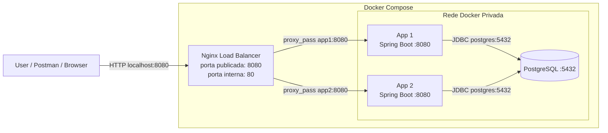

# 02 — Load Balancer com Nginx

> Laboratório de System Design para praticar **load balancing**, **reverse proxy**, **Docker Compose** e isolamento de serviços em rede privada.

Este módulo faz parte do repositório [`system-design-lab`](../README.md) e representa uma evolução arquitetural importante: em vez de expor a aplicação Spring Boot diretamente, agora existe um **Nginx na frente da aplicação**, atuando como **ponto único de entrada** e distribuindo as requisições entre duas instâncias da mesma API.

---

## Objetivo do módulo

O objetivo deste laboratório é entender, na prática, como funciona uma arquitetura com **load balancer**:

```text
Usuário -> Nginx -> App 1 / App 2 -> PostgreSQL
```

Neste cenário:

- o usuário acessa apenas o **Nginx**;
- o Nginx recebe as requisições HTTP;
- o Nginx distribui as requisições entre duas instâncias da aplicação Spring Boot;
- as aplicações acessam um PostgreSQL em container;
- as aplicações e o banco ficam em uma rede Docker interna;
- somente o Nginx possui porta publicada para fora do Docker Compose.

A ideia é simular localmente um conceito muito comum em arquiteturas reais, como:

```text
AWS Application Load Balancer -> EC2 1 / EC2 2 -> RDS
```

---

## Arquitetura


### Visão conceitual



---

## O que mudou em relação ao laboratório anterior

| Antes | Agora |
|---|---|
| Uma aplicação acessada diretamente | Duas instâncias da aplicação atrás do Nginx |
| Cliente chamava a API diretamente | Cliente chama apenas o load balancer |
| Aplicação exposta para o host | Aplicações privadas dentro da rede Docker |
| PostgreSQL podia ser exposto localmente | PostgreSQL fica privado no Docker Compose |
| Foco em persistência separada | Foco em distribuição de carga e entrada única |

---

## Tecnologias utilizadas

- Java 21
- Spring Boot
- Spring Web
- Spring Data JPA
- Hibernate
- PostgreSQL
- Docker
- Docker Compose
- Nginx
- Maven
- Postman, Insomnia ou navegador para testes

---

## Componentes da arquitetura

### Nginx

O Nginx atua como **load balancer** e **reverse proxy**.

Ele é o único serviço com porta publicada para o host:

```yaml
ports:
  - "8080:80"
```

Isso significa:

```text
localhost:8080 -> container nginx na porta 80
```

A partir daí, o Nginx encaminha as requisições para uma das aplicações disponíveis no grupo `delivery_apps`.

---

### App 1 e App 2

`app1` e `app2` são duas instâncias da mesma aplicação Spring Boot.

Ambas usam a mesma imagem Docker:

```yaml
image: delivery-api:latest
```

Cada uma roda internamente na porta `8080`, mas nenhuma delas publica porta para o host.

Ou seja, do seu Windows você **não acessa** diretamente:

```text
localhost:8081
localhost:8082
```

Você acessa somente:

```text
localhost:8080
```

E quem decide se a requisição vai para `app1` ou `app2` é o Nginx.

---

### PostgreSQL

O PostgreSQL roda em container e também fica privado na rede Docker.

As aplicações acessam o banco usando o nome do serviço no Docker Compose:

```text
postgres:5432
```

Não se usa `localhost` dentro de container para acessar outro container.

Dentro do Docker Compose, o host correto do banco é:

```text
postgres
```

---

## Configuração do Nginx

Arquivo:

```text
nginx/nginx.conf
```

Exemplo da configuração principal:

```nginx
worker_processes 1;

events {
    worker_connections 1024;
}

http {
    upstream delivery_apps {
        server app1:8080;
        server app2:8080;
    }

    server {
        listen 80;

        location / {
            proxy_pass http://delivery_apps;

            proxy_set_header Host $host;
            proxy_set_header X-Real-IP $remote_addr;
            proxy_set_header X-Forwarded-For $proxy_add_x_forwarded_for;
            proxy_set_header X-Forwarded-Proto $scheme;
        }
    }
}
```

### Explicando a configuração

```nginx
upstream delivery_apps {
    server app1:8080;
    server app2:8080;
}
```

Define um grupo de backends chamado `delivery_apps`.

Esse grupo contém duas instâncias da aplicação:

```text
app1:8080
app2:8080
```

No Docker Compose, `app1` e `app2` são nomes de serviços, e o Docker resolve esses nomes dentro da rede interna.

```nginx
server {
    listen 80;
}
```

Faz o Nginx escutar requisições HTTP na porta `80` dentro do container.

```nginx
location / {
    proxy_pass http://delivery_apps;
}
```

Encaminha toda requisição recebida para uma das instâncias do grupo `delivery_apps`.

---

## Docker Compose

Arquivo:

```text
docker-compose.yml
```

Estrutura principal:

```yaml
services:
  nginx:
    image: nginx:latest
    container_name: nginx-lb
    ports:
      - "8080:80"
    volumes:
      - ./nginx/nginx.conf:/etc/nginx/nginx.conf:ro
    depends_on:
      - app1
      - app2
    networks:
      - app-network

  app1:
    image: delivery-api:latest
    container_name: delivery-app-1
    environment:
      SERVER_PORT: 8080
      DB_HOST: postgres
      DB_PORT: 5432
      POSTGRES_DB: ${POSTGRES_DB}
      POSTGRES_USER: ${POSTGRES_USER}
      POSTGRES_PASSWORD: ${POSTGRES_PASSWORD}
    depends_on:
      - postgres
    networks:
      - app-network

  app2:
    image: delivery-api:latest
    container_name: delivery-app-2
    environment:
      SERVER_PORT: 8080
      DB_HOST: postgres
      DB_PORT: 5432
      POSTGRES_DB: ${POSTGRES_DB}
      POSTGRES_USER: ${POSTGRES_USER}
      POSTGRES_PASSWORD: ${POSTGRES_PASSWORD}
    depends_on:
      - postgres
    networks:
      - app-network

  postgres:
    image: postgres:16
    container_name: postgres-local
    restart: unless-stopped
    environment:
      POSTGRES_DB: ${POSTGRES_DB}
      POSTGRES_USER: ${POSTGRES_USER}
      POSTGRES_PASSWORD: ${POSTGRES_PASSWORD}
    volumes:
      - postgres_data:/var/lib/postgresql/data
    networks:
      - app-network

volumes:
  postgres_data:

networks:
  app-network:
    driver: bridge
```

---

## Por que apenas o Nginx tem `ports`?

No Compose, somente o Nginx publica porta para o host:

```yaml
ports:
  - "8080:80"
```

Isso torna o Nginx a única porta de entrada da aplicação.

As aplicações e o banco ficam sem `ports`, portanto permanecem acessíveis apenas dentro da rede Docker:

```text
nginx -> app1:8080
nginx -> app2:8080
app1/app2 -> postgres:5432
```

Esse desenho aproxima o laboratório de uma arquitetura real, onde os serviços internos não deveriam ser expostos diretamente para o usuário final.

---

## Variáveis de ambiente

Arquivo:

```text
.env
```

Exemplo:

```env
POSTGRES_DB=app_db
POSTGRES_USER=app_user
POSTGRES_PASSWORD=app_password
POSTGRES_PORT=5432
```

> Observação: neste laboratório, o `POSTGRES_PORT` pode existir no `.env`, mas o banco não precisa publicar porta para o host se a intenção for manter o PostgreSQL privado dentro da rede Docker.

---

## Configuração da aplicação Spring Boot

Para a aplicação funcionar tanto localmente quanto em container, a URL do banco deve ser parametrizada por variáveis de ambiente.

Exemplo:

```yaml
spring:
  application:
    name: delivery-api

  datasource:
    url: jdbc:postgresql://${DB_HOST:localhost}:${DB_PORT:5432}/${POSTGRES_DB:app_db}
    username: ${POSTGRES_USER:app_user}
    password: ${POSTGRES_PASSWORD:app_password}
    driver-class-name: org.postgresql.Driver

  jpa:
    hibernate:
      ddl-auto: create-drop
    show-sql: true
    properties:
      hibernate:
        format_sql: true

server:
  port: ${SERVER_PORT:8080}
```

### Por que não usar `localhost` no Docker?

Dentro de um container, `localhost` aponta para o próprio container.

Portanto, se a aplicação tentar conectar em:

```text
localhost:5432
```

ela procurará um PostgreSQL dentro do container da própria aplicação.

Como o PostgreSQL está em outro container, o correto é usar o nome do serviço:

```text
postgres:5432
```

---

## Dockerfile

Arquivo:

```text
Dockerfile
```

Exemplo utilizado para empacotar a aplicação Spring Boot:

```dockerfile
FROM eclipse-temurin:21-jre-alpine

WORKDIR /app

COPY target/*.jar app.jar

EXPOSE 8080

ENTRYPOINT ["java", "-jar", "app.jar"]
```

---

## Como executar o projeto

### 1. Gerar o `.jar`

Na raiz do módulo:

```bash
mvn clean package -DskipTests
```

Ou, se quiser executar os testes:

```bash
mvn clean package
```

---

### 2. Criar a imagem Docker da aplicação

```bash
docker build -t delivery-api:latest .
```

Esse comando cria uma imagem local chamada:

```text
delivery-api:latest
```

Essa imagem será usada por `app1` e `app2` no Docker Compose.

---

### 3. Subir a arquitetura completa

```bash
docker compose up -d
```

---

### 4. Verificar os containers

```bash
docker compose ps
```

Resultado esperado:

```text
nginx-lb         Up
postgres-local   Up
delivery-app-1   Up
delivery-app-2   Up
```

---

### 5. Acessar a API

Base URL:

```text
http://localhost:8080
```

Todas as chamadas devem ser feitas pelo Nginx.

Exemplo:

```text
http://localhost:8080/api/v1/items
```

---

## Como validar o balanceamento

A forma mais simples de visualizar o balanceamento é criar um endpoint que retorne o hostname do container.

Exemplo:

```java
@RestController
public class InstanceController {

    @Value("${HOSTNAME:unknown}")
    private String hostname;

    @GetMapping("/whoami")
    public String whoami() {
        return "Resposta da instância: " + hostname;
    }
}
```

Depois acesse várias vezes:

```text
http://localhost:8080/whoami
```

A resposta tende a alternar entre os containers, mostrando que o Nginx está distribuindo as requisições entre `app1` e `app2`.

---

## Endpoints disponíveis

| Método | Endpoint | Descrição |
|---|---|---|
| `POST` | `/api/v1/items` | Cria um produto |
| `GET` | `/api/v1/items` | Lista produtos |
| `GET` | `/api/v1/items/{id}` | Busca produto por ID |
| `POST` | `/api/v1/persons` | Cria uma pessoa |
| `GET` | `/api/v1/persons` | Lista pessoas |
| `GET` | `/api/v1/persons/{id}` | Busca pessoa por ID |
| `POST` | `/api/v1/carts/persons/{personId}` | Cria carrinho para uma pessoa |
| `GET` | `/api/v1/carts/persons/{personId}` | Consulta carrinho da pessoa |
| `POST` | `/api/v1/carts/persons/{personId}/items` | Adiciona item ao carrinho |
| `DELETE` | `/api/v1/carts/persons/{personId}/items/{cartItemId}` | Remove item do carrinho |

---

## Fluxo de teste no Postman

### 1. Criar produto

```http
POST http://localhost:8080/api/v1/items
Content-Type: application/json
```

```json
{
  "sku": "BURGER-001",
  "name": "Burger Artesanal",
  "unitPrice": 29.90
}
```

---

### 2. Criar pessoa

```http
POST http://localhost:8080/api/v1/persons
Content-Type: application/json
```

```json
{
  "name": "Felipe",
  "age": 25,
  "document": "12345678900",
  "zipCode": "20000000",
  "street": "Rua Exemplo",
  "number": "100",
  "complement": "Apto 101",
  "neighborhood": "Centro",
  "city": "Rio de Janeiro",
  "state": "RJ"
}
```

---

### 3. Criar carrinho para a pessoa

```http
POST http://localhost:8080/api/v1/carts/persons/1
```

---

### 4. Adicionar item ao carrinho

```http
POST http://localhost:8080/api/v1/carts/persons/1/items
Content-Type: application/json
```

```json
{
  "itemId": 1,
  "quantity": 2
}
```

---

### 5. Consultar carrinho

```http
GET http://localhost:8080/api/v1/carts/persons/1
```

---

## Comandos úteis

### Ver logs de todos os serviços

```bash
docker compose logs -f
```

### Ver logs do Nginx

```bash
docker compose logs -f nginx
```

### Ver logs da primeira aplicação

```bash
docker compose logs -f app1
```

### Ver logs da segunda aplicação

```bash
docker compose logs -f app2
```

### Ver logs do PostgreSQL

```bash
docker compose logs -f postgres
```

### Derrubar os containers

```bash
docker compose down
```

### Derrubar os containers e remover volume do banco

```bash
docker compose down -v
```

Use `-v` apenas se quiser apagar também os dados persistidos no volume do PostgreSQL.

---

## Problemas comuns

### `Connection to localhost:5432 refused`

Esse erro acontece quando a aplicação em container tenta acessar o banco usando `localhost`.

Dentro do Docker Compose, a aplicação deve acessar o banco pelo nome do serviço:

```text
postgres:5432
```

A URL correta deve ficar parecida com:

```text
jdbc:postgresql://postgres:5432/app_db
```

---

### `502 Bad Gateway` no Nginx

Esse erro geralmente significa que o Nginx subiu, mas não conseguiu alcançar as aplicações.

Verifique:

```bash
docker compose ps
```

E depois:

```bash
docker compose logs app1
docker compose logs app2
```

---

### Alterei o código, mas o container continua igual

É necessário gerar o `.jar` novamente e rebuildar a imagem:

```bash
mvn clean package -DskipTests
docker build -t delivery-api:latest .
docker compose up -d
```

---

## Conceitos praticados

- Load Balancer
- Reverse Proxy
- Round-robin básico com Nginx
- Rede privada no Docker Compose
- Múltiplas instâncias da mesma aplicação
- Banco de dados isolado em container
- Comunicação entre containers por nome de serviço
- Separação entre serviços públicos e privados
- Base conceitual para AWS ALB, Target Groups, EC2 privadas e RDS privado

---

## Próximos passos sugeridos

- Adicionar endpoint `/whoami` para visualizar a instância que respondeu.
- Adicionar healthcheck nas aplicações e no PostgreSQL.
- Configurar o Nginx para considerar apenas backends saudáveis.
- Evoluir para múltiplas instâncias com escala via Docker Compose.
- Reproduzir a mesma arquitetura na AWS usando Application Load Balancer, EC2 e RDS.
- Evoluir a persistência com Flyway ou Liquibase em vez de `ddl-auto: create-drop`.

---

## Resultado esperado

Ao final deste laboratório, a aplicação deve estar acessível por uma única URL:

```text
http://localhost:8080
```

Internamente, o Nginx distribui as requisições entre duas instâncias Spring Boot privadas, e ambas acessam o PostgreSQL também privado dentro da rede Docker.

Esse laboratório consolida a ideia de **entrada única + serviços internos privados**, um dos fundamentos mais importantes para arquiteturas distribuídas e implantações em cloud.
