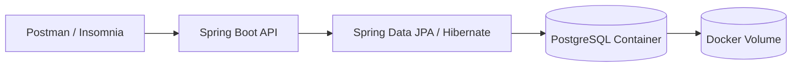

# 03 — Database Separation

> Laboratório de System Design para separar a aplicação do banco de dados, substituindo o H2 em memória por um PostgreSQL executando em container via Docker Compose.

Este módulo faz parte do repositório **system-design-lab** e representa a evolução natural do laboratório anterior de aplicação monolítica local. A regra de negócio principal continua sendo o fluxo de carrinho de uma API de delivery, mas agora a persistência deixa de ser feita em banco embarcado/in-memory e passa a usar um banco relacional externo.

---

## Objetivo do módulo

O foco deste laboratório não é adicionar novas regras de negócio complexas. O objetivo principal é praticar um passo essencial em System Design:

```text
Aplicação Spring Boot  --->  PostgreSQL externo
```

Antes, a aplicação usava **H2 Database**, um banco em memória útil para testes rápidos e protótipos. Neste módulo, o H2 foi removido e substituído por um **PostgreSQL isolado em container**, criado com Docker Compose.

Com isso, o projeto começa a se aproximar de uma arquitetura mais realista, onde aplicação e banco são componentes separados.

---

## O que mudou em relação ao laboratório anterior

| Antes | Agora |
|---|---|
| Banco H2 em memória | PostgreSQL em container |
| Dados voláteis ao reiniciar a aplicação | Dados persistidos em volume Docker |
| Banco acoplado ao runtime da aplicação | Banco separado da aplicação |
| Configuração mais simples para protótipo | Configuração mais próxima de ambiente real |
| Menor fidelidade com produção | Melhor base para evoluir para cloud |

---

## Arquitetura do laboratório



### Visão conceitual

```text
Usuário testa a API no Postman
        ↓
Spring Boot recebe a requisição
        ↓
Controller chama o fluxo de aplicação
        ↓
Repository usa Spring Data JPA
        ↓
Hibernate gera SQL
        ↓
PostgreSQL persiste os dados
        ↓
Volume Docker mantém os dados do banco
```

---

## Tecnologias utilizadas

- Java
- Spring Boot
- Spring Web
- Spring Data JPA
- Hibernate
- PostgreSQL
- Docker
- Docker Compose
- Maven
- Postman ou Insomnia para testes

---

## Domínio da aplicação

A aplicação continua representando um fluxo simples de delivery com carrinho.

```text
Person 1 --- 1 Cart
Cart   1 --- N CartItem
CartItem N --- 1 Item
```

### Entidades principais

#### `Person`

Representa a pessoa/cliente da aplicação.

```text
Person
- id
- name
- age
- document
- zipCode
- street
- number
- complement
- neighborhood
- city
- state
- cart
```

#### `Item`

Representa um produto cadastrado no catálogo.

```text
Item
- id
- sku
- name
- unitPrice
```

#### `Cart`

Representa o carrinho vinculado a uma pessoa.

```text
Cart
- id
- person
- items
- totalValue
```

#### `CartItem`

Representa uma linha dentro do carrinho.

```text
CartItem
- id
- item
- quantity
- unitValue
- totalValue
```

---

## Regra importante sobre preço

O frontend não envia o preço do produto ao adicionar um item no carrinho.

A requisição envia apenas:

```json
{
  "itemId": 1,
  "quantity": 2
}
```

O backend faz o seguinte:

```text
1. Busca o produto pelo itemId.
2. Lê o preço oficial salvo no banco.
3. Copia esse preço para CartItem.unitValue.
4. Calcula o total da linha com quantity * unitValue.
5. Recalcula o total do carrinho.
```

Isso evita que o cliente da API manipule o preço do produto na requisição.

---

## Estrutura esperada do módulo

Uma estrutura possível para este laboratório:

```text
03-database-separation
├── src
│   └── main
│       ├── java
│       └── resources
│           └── application.yml
├── docker-compose.yml
├── pom.xml
└── README.md
```

---

## Configuração do PostgreSQL com Docker Compose

Exemplo de `docker-compose.yml`:

```yaml
services:
  postgres:
    image: postgres:16
    container_name: postgres-local
    restart: unless-stopped

    ports:
      - "${POSTGRES_PORT}:5432"

    environment:
      POSTGRES_DB: ${POSTGRES_DB}
      POSTGRES_USER: ${POSTGRES_USER}
      POSTGRES_PASSWORD: ${POSTGRES_PASSWORD}

    volumes:
      - postgres_data:/var/lib/postgresql/data

volumes:
  postgres_data:
```

---

## Variáveis de ambiente

Crie um arquivo `.env` na raiz do módulo:

```env
POSTGRES_DB=delivery_db
POSTGRES_USER=delivery_user
POSTGRES_PASSWORD=delivery_pass
POSTGRES_PORT=5432
```

> O arquivo `.env` facilita a configuração local e evita deixar credenciais fixas diretamente no `docker-compose.yml`.

---

## Configuração da aplicação

Exemplo de `application.yml` usando PostgreSQL:

```yaml
spring:
  application:
    name: delivery-api

  datasource:
    url: jdbc:postgresql://localhost:${POSTGRES_PORT}/${POSTGRES_DB}
    username: ${POSTGRES_USER}
    password: ${POSTGRES_PASSWORD}

  jpa:
    hibernate:
      ddl-auto: create-drop
    show-sql: true
    properties:
      hibernate:
        format_sql: true

server:
  port: 8080
```

### Observação sobre `ddl-auto`

Neste laboratório, `ddl-auto: create-drop` pode ser usado para estudo, porque recria as tabelas automaticamente ao subir a aplicação.

Para um ambiente mais próximo de produção, o ideal seria evoluir para:

```yaml
spring:
  jpa:
    hibernate:
      ddl-auto: validate
```

E controlar a evolução do schema com uma ferramenta como **Flyway** ou **Liquibase**.

---

## Como executar o projeto

### 1. Subir o PostgreSQL

Na pasta do módulo:

```bash
docker compose up -d
```

Verifique se o container subiu:

```bash
docker ps
```

Você deve ver algo parecido com:

```text
postgres-local   postgres:16   Up   0.0.0.0:5432->5432/tcp
```

---

### 2. Rodar a aplicação Spring Boot

Com o PostgreSQL rodando, execute:

```bash
mvn spring-boot:run
```

Ou, se preferir gerar o pacote:

```bash
mvn clean package
java -jar target/*.jar
```

---

### 3. Acessar a API

Base URL:

```text
http://localhost:8080
```

---

## Endpoints disponíveis

| Método | Endpoint | Descrição |
|---|---|---|
| `POST` | `/api/v1/items` | Cria um produto |
| `GET` | `/api/v1/items` | Lista produtos |
| `GET` | `/api/v1/items/{id}` | Busca produto por ID |
| `POST` | `/api/v1/persons` | Cria uma pessoa |
| `GET` | `/api/v1/persons` | Lista pessoas |
| `GET` | `/api/v1/persons/{id}` | Busca pessoa por ID |
| `POST` | `/api/v1/carts/persons/{personId}` | Cria carrinho para uma pessoa |
| `GET` | `/api/v1/carts/persons/{personId}` | Consulta carrinho da pessoa |
| `POST` | `/api/v1/carts/persons/{personId}/items` | Adiciona item ao carrinho |
| `DELETE` | `/api/v1/carts/persons/{personId}/items/{cartItemId}` | Remove item do carrinho |

---

## Fluxo de teste no Postman

### 1. Criar produto

```http
POST http://localhost:8080/api/v1/items
Content-Type: application/json
```

```json
{
  "sku": "BURGER-001",
  "name": "Burger Artesanal",
  "unitPrice": 29.90
}
```

---

### 2. Criar outro produto

```http
POST http://localhost:8080/api/v1/items
Content-Type: application/json
```

```json
{
  "sku": "FRIES-001",
  "name": "Batata Frita",
  "unitPrice": 14.90
}
```

---

### 3. Listar produtos

```http
GET http://localhost:8080/api/v1/items
```

Resposta esperada aproximada:

```json
[
  {
    "id": 1,
    "sku": "BURGER-001",
    "name": "Burger Artesanal",
    "unitPrice": 29.90
  },
  {
    "id": 2,
    "sku": "FRIES-001",
    "name": "Batata Frita",
    "unitPrice": 14.90
  }
]
```

---

### 4. Criar pessoa

```http
POST http://localhost:8080/api/v1/persons
Content-Type: application/json
```

```json
{
  "name": "Felipe Matheus",
  "age": 25,
  "document": "12345678909",
  "zipCode": "01001-000",
  "street": "Rua Exemplo",
  "number": 100,
  "complement": "Apartamento 202",
  "neighborhood": "Centro",
  "city": "São Paulo",
  "state": "SP"
}
```

---

### 5. Criar carrinho para a pessoa

```http
POST http://localhost:8080/api/v1/carts/persons/1
Content-Type: application/json
```

Não é necessário enviar body.

---

### 6. Adicionar produto ao carrinho

```http
POST http://localhost:8080/api/v1/carts/persons/1/items
Content-Type: application/json
```

```json
{
  "itemId": 1,
  "quantity": 2
}
```

---

### 7. Adicionar outro produto ao carrinho

```http
POST http://localhost:8080/api/v1/carts/persons/1/items
Content-Type: application/json
```

```json
{
  "itemId": 2,
  "quantity": 1
}
```

---

### 8. Consultar carrinho

```http
GET http://localhost:8080/api/v1/carts/persons/1
```

Resposta esperada aproximada:

```json
{
  "id": 1,
  "items": [
    {
      "id": 1,
      "quantity": 2,
      "unitValue": 29.90,
      "item": {
        "id": 1,
        "sku": "BURGER-001",
        "name": "Burger Artesanal",
        "unitPrice": 29.90
      },
      "totalValue": 59.80
    },
    {
      "id": 2,
      "quantity": 1,
      "unitValue": 14.90,
      "item": {
        "id": 2,
        "sku": "FRIES-001",
        "name": "Batata Frita",
        "unitPrice": 14.90
      },
      "totalValue": 14.90
    }
  ],
  "totalValue": 74.70
}
```

---

### 9. Remover item do carrinho

Use o `id` do `CartItem`, não o `itemId` do produto.

```http
DELETE http://localhost:8080/api/v1/carts/persons/1/items/2
```

---

### 10. Consultar carrinho novamente

```http
GET http://localhost:8080/api/v1/carts/persons/1
```

Agora o carrinho deve retornar sem o item removido.

---

## Ordem resumida de testes

```text
1. POST   /api/v1/items
2. POST   /api/v1/items
3. GET    /api/v1/items

4. POST   /api/v1/persons
5. GET    /api/v1/persons

6. POST   /api/v1/carts/persons/1
7. POST   /api/v1/carts/persons/1/items
8. POST   /api/v1/carts/persons/1/items
9. GET    /api/v1/carts/persons/1
10. DELETE /api/v1/carts/persons/1/items/2
11. GET    /api/v1/carts/persons/1
```

---

## Como verificar os dados no PostgreSQL

Você pode entrar no container:

```bash
docker exec -it postgres-local psql -U delivery_user -d delivery_db
```

Listar tabelas:

```sql
\dt
```

Consultar produtos:

```sql
SELECT * FROM item;
```

Consultar pessoas:

```sql
SELECT * FROM person;
```

Consultar carrinhos:

```sql
SELECT * FROM cart;
```

Consultar itens do carrinho:

```sql
SELECT * FROM cart_item;
```

Sair do `psql`:

```sql
\q
```

---

## Comandos úteis do Docker

Subir o banco:

```bash
docker compose up -d
```

Ver logs do PostgreSQL:

```bash
docker logs -f postgres-local
```

Parar o banco:

```bash
docker compose stop
```

Parar e remover container, mantendo volume:

```bash
docker compose down
```

Parar e remover container junto com os dados persistidos:

```bash
docker compose down -v
```

> Use `docker compose down -v` apenas quando quiser apagar o banco local e começar do zero.

---

## Principais aprendizados deste módulo

- Separar aplicação e banco é um passo importante rumo a uma arquitetura mais realista.
- H2 é excelente para protótipos, mas PostgreSQL representa melhor um cenário próximo de produção.
- Docker Compose facilita subir dependências locais sem instalar tudo diretamente na máquina.
- Volumes Docker permitem persistir os dados mesmo após parar o container.
- A aplicação Spring Boot passa a depender da disponibilidade do PostgreSQL para iniciar corretamente.
- Configurações por variável de ambiente deixam o projeto mais flexível e menos acoplado à máquina local.

---

## Próximos passos possíveis

Este módulo pode evoluir para:

- Dockerizar também a aplicação Spring Boot.
- Criar um `docker-compose.yml` com API + PostgreSQL.
- Adicionar Flyway ou Liquibase para versionamento do banco.
- Criar DTOs para evitar retorno direto de entidades JPA.
- Adicionar validações com Bean Validation.
- Criar tratamento global de erros com `@RestControllerAdvice`.
- Separar leitura e escrita em cenários futuros.
- Adicionar Redis como cache.
- Adicionar mensageria com RabbitMQ ou Kafka.
- Evoluir para implantação em AWS usando EC2, RDS, Security Groups e subnets.

---

## Relação com System Design

Este laboratório representa a transição de uma aplicação simples para uma arquitetura com componentes separados.

```text
Módulo 01: aplicação simples local
Módulo 02: load balancer local com Nginx
Módulo 03: separação entre aplicação e banco de dados
```

A partir daqui, fica mais fácil evoluir para cenários como:

```text
API em uma instância/container
Banco em outra instância/container
Rede controlada entre aplicação e banco
Persistência independente do ciclo de vida da aplicação
Migração futura para banco gerenciado, como Amazon RDS
```

---

## Observação final

Este projeto continua sendo um laboratório didático. A principal evolução deste módulo é trocar o banco embarcado por um banco externo, mantendo a regra de negócio simples para que o foco fique claro:

```text
Separar responsabilidades de infraestrutura.
A aplicação executa a regra de negócio.
O PostgreSQL persiste os dados.
O Docker Compose orquestra a dependência local.
```
