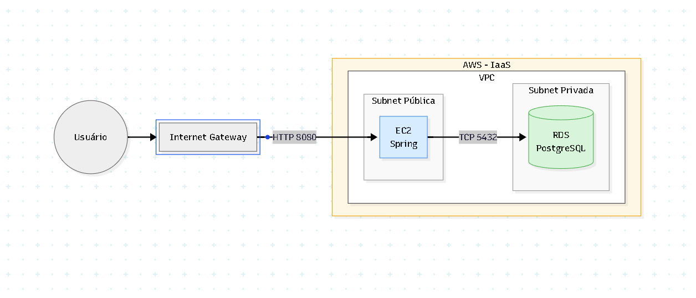

# 03 — Database Separation AWS IaaS

> Laboratório de System Design para evoluir a separação entre aplicação e banco de dados para um cenário em **AWS IaaS**, usando **EC2 pública com Docker** e **Amazon RDS PostgreSQL privado**.

Este módulo faz parte do repositório **system-design-lab** e representa a evolução do laboratório `03-database-separation`, onde a aplicação deixou de usar H2 e passou a se conectar a um PostgreSQL externo. Agora, a mesma ideia foi levada para a AWS.

A regra de negócio principal continua sendo o fluxo de carrinho de uma API de delivery, mas a infraestrutura passa a simular um cenário mais próximo de produção:

```text
Usuário
  ↓ HTTP 8080
Internet Gateway
  ↓
EC2 pública rodando Spring Boot em Docker
  ↓ TCP 5432
RDS PostgreSQL em subnet privada
```

---

## Arquitetura



### Visão conceitual

```text
Usuário/Postman
  ↓
Internet
  ↓
Internet Gateway
  ↓
Subnet pública
  ↓
EC2 com Docker
  ↓
Container Spring Boot
  ↓
Security Group liberando TCP 5432 somente da EC2
  ↓
Subnet privada
  ↓
Amazon RDS PostgreSQL
```

---

## Objetivo do módulo

O objetivo deste laboratório é praticar um passo essencial em System Design e Cloud:

```text
Aplicação em compute separado
        ↓
Banco de dados gerenciado e isolado em rede privada
```

Neste módulo, a aplicação Spring Boot é empacotada em uma imagem Docker, enviada para o Docker Hub e executada em uma instância EC2 pública.

O banco de dados deixa de ser um container local via Docker Compose e passa a ser um **Amazon RDS PostgreSQL**, criado em subnets privadas e acessível apenas pela EC2.

---

## O que mudou em relação ao laboratório anterior

| Antes — `03-database-separation` | Agora — `03-database-separation-aws-iaas` |
|---|---|
| Spring Boot rodando localmente | Spring Boot rodando em Docker dentro de uma EC2 |
| PostgreSQL em Docker Compose local | PostgreSQL em Amazon RDS |
| Banco acessível via `localhost` | Banco acessível via endpoint privado do RDS |
| Rede local da máquina | VPC, subnets, route tables e security groups |
| Dependência local com Docker Compose | Infraestrutura AWS IaaS |
| Testes em `localhost:8080` | Testes no IP público da EC2 na porta `8080` |

---

## Tecnologias utilizadas

- Java 21
- Spring Boot
- Spring Web
- Spring Data JPA
- Hibernate
- PostgreSQL
- Amazon EC2
- Amazon RDS PostgreSQL
- Amazon VPC
- Subnet pública
- Subnets privadas
- Internet Gateway
- Route Table
- Security Groups
- Docker
- Docker Hub
- Maven
- Postman ou Insomnia

---

## Domínio da aplicação

A aplicação continua representando um fluxo simples de delivery com carrinho.

```text
Person 1 --- 1 Cart
Cart   1 --- N CartItem
CartItem N --- 1 Item
```

### Entidades principais

#### `Person`

Representa a pessoa/cliente da aplicação.

```text
Person
- id
- name
- age
- document
- zipCode
- street
- number
- complement
- neighborhood
- city
- state
- cart
```

#### `Item`

Representa um produto cadastrado no catálogo.

```text
Item
- id
- sku
- name
- unitPrice
```

#### `Cart`

Representa o carrinho vinculado a uma pessoa.

```text
Cart
- id
- person
- items
- totalValue
```

#### `CartItem`

Representa uma linha dentro do carrinho.

```text
CartItem
- id
- item
- quantity
- unitValue
- totalValue
```

---

## Regra importante sobre preço

O frontend não envia o preço do produto ao adicionar um item no carrinho.

A requisição envia apenas:

```json
{
  "itemId": 1,
  "quantity": 2
}
```

O backend faz o seguinte:

```text
1. Busca o produto pelo itemId.
2. Lê o preço oficial salvo no banco.
3. Copia esse preço para CartItem.unitValue.
4. Calcula o total da linha com quantity * unitValue.
5. Recalcula o total do carrinho.
```

Isso evita que o cliente da API manipule o preço do produto na requisição.

---

## Estrutura esperada do módulo

```text
03-database-separation-aws-iaas
├── src
│   └── main
│       ├── java
│       └── resources
│           └── application.yml
├── arquitetura-aws-iaas.bmp
├── Dockerfile
├── pom.xml
└── README.md
```

---

## Configuração da aplicação

O `application.yml` deve receber as configurações do banco por variáveis de ambiente.

Exemplo:

```yaml
spring:
  application:
    name: delivery-api

  datasource:
    url: ${SPRING_DATASOURCE_URL}
    username: ${SPRING_DATASOURCE_USERNAME}
    password: ${SPRING_DATASOURCE_PASSWORD}

  jpa:
    hibernate:
      ddl-auto: update
    show-sql: true
    properties:
      hibernate:
        format_sql: true

server:
  port: 8080
```

### Por que usar variáveis de ambiente?

Porque a mesma imagem Docker pode rodar em ambientes diferentes:

```text
Local
EC2
Ambiente de teste
Ambiente de produção
```

Sem precisar rebuildar a imagem.

Na EC2, por exemplo, a URL do banco aponta para o endpoint do RDS:

```text
jdbc:postgresql://endpoint-do-rds.amazonaws.com:5432/deliverydb
```

---

## Dockerfile

Exemplo de `Dockerfile` usado para empacotar a aplicação:

```dockerfile
FROM eclipse-temurin:21-jdk-alpine

WORKDIR /app

COPY target/*.jar app.jar

EXPOSE 8080

ENTRYPOINT ["java", "-jar", "app.jar"]
```

### Fluxo do Dockerfile

```text
1. Usa uma imagem base com Java 21.
2. Define o diretório de trabalho como /app.
3. Copia o JAR gerado pelo Maven.
4. Expõe a porta 8080.
5. Executa a aplicação com java -jar.
```

---

## Build da aplicação

Na raiz do módulo:

```bash
mvn clean package
```

Se quiser pular os testes temporariamente durante o laboratório:

```bash
mvn clean package -DskipTests
```

O JAR será gerado dentro da pasta:

```text
target/
```

---

## Build da imagem Docker

```bash
docker build -t delivery-api-database-separation-aws .
```

Verificar se a imagem foi criada:

```bash
docker images
```

---

## Tag da imagem para Docker Hub

Substitua `felipematheus1337` pelo usuário correto do Docker Hub, se necessário.

```bash
docker tag delivery-api-database-separation-aws felipematheus1337/delivery-api-database-separation-aws:1.0
```

Também é possível criar uma tag `latest`:

```bash
docker tag delivery-api-database-separation-aws felipematheus1337/delivery-api-database-separation-aws:latest
```

---

## Push para Docker Hub

Faça login:

```bash
docker login
```

Envie a imagem:

```bash
docker push felipematheus1337/delivery-api-database-separation-aws:1.0
```

```bash
docker push felipematheus1337/delivery-api-database-separation-aws:latest
```

A partir daqui, a EC2 consegue baixar a imagem com:

```bash
docker pull felipematheus1337/delivery-api-database-separation-aws:latest
```

---

## Infraestrutura AWS criada

### VPC

```text
VPC: delivery-lab-vpc
CIDR: 10.0.0.0/16
```

A VPC representa a rede privada do laboratório dentro da AWS.

---

### Subnet pública

```text
Subnet pública: delivery-public-subnet-a
CIDR sugerido: 10.0.1.0/24
```

Responsabilidade:

```text
Hospedar a EC2 que recebe requisições HTTP pela internet.
```

---

### Subnets privadas

```text
Subnet privada A: delivery-private-db-subnet-a
CIDR sugerido: 10.0.2.0/24

Subnet privada B: delivery-private-db-subnet-b
CIDR sugerido: 10.0.3.0/24
```

Responsabilidade:

```text
Hospedar o RDS em uma camada privada, sem exposição pública.
```

O RDS normalmente usa um DB Subnet Group com subnets em mais de uma Availability Zone.

---

### Internet Gateway

```text
Internet Gateway: delivery-lab-igw
```

Responsabilidade:

```text
Permitir que a subnet pública tenha entrada e saída para a internet.
```

---

### Route Table pública

Rota principal:

```text
Destination: 0.0.0.0/0
Target: Internet Gateway
```

Responsabilidade:

```text
Transformar a subnet da EC2 em uma subnet pública.
```

---

### Security Group da EC2

Inbound:

```text
SSH
Porta: 22
Origem: seu IP /32
```

```text
HTTP da aplicação
Porta: 8080
Origem: 0.0.0.0/0
```

Outbound:

```text
All traffic
Destino: 0.0.0.0/0
```

Responsabilidade:

```text
Permitir acesso SSH administrativo e acesso HTTP à API.
```

---

### Security Group do RDS

Inbound:

```text
PostgreSQL
Porta: 5432
Origem: Security Group da EC2
```

Responsabilidade:

```text
Permitir conexão ao banco somente a partir da EC2.
```

Esse é um dos pontos mais importantes do laboratório:

```text
O banco não fica público.
O banco não aceita conexão de qualquer IP.
Apenas a aplicação na EC2 consegue se conectar ao RDS.
```

---

## Criação do RDS PostgreSQL

Configuração usada no laboratório:

```text
Engine: PostgreSQL
Public access: No
Port: 5432
DB name: deliverydb
VPC: delivery-lab-vpc
Subnet Group: subnets privadas
Security Group: delivery-rds-sg
```

Após a criação, o RDS fornece um endpoint parecido com:

```text
delivery-postgres.xxxxxxxxx.us-east-1.rds.amazonaws.com
```

Esse endpoint é usado na variável:

```text
SPRING_DATASOURCE_URL
```

---

## Criação da EC2

Configuração usada no laboratório:

```text
AMI: Amazon Linux 2023
Instance type: t2.micro ou t3.micro
Subnet: pública
Auto-assign public IP: enabled
Security Group: delivery-ec2-sg
```

A EC2 representa a camada de aplicação.

---

## Instalação do Docker na EC2

Acessar a EC2 via SSH:

```bash
ssh -i sua-chave.pem ec2-user@IP_PUBLICO_DA_EC2
```

Instalar Docker:

```bash
sudo yum update -y
```

```bash
sudo yum install docker -y
```

```bash
sudo systemctl start docker
```

```bash
sudo systemctl enable docker
```

Adicionar o usuário ao grupo Docker:

```bash
sudo usermod -aG docker ec2-user
```

Depois saia e entre novamente no SSH, ou rode:

```bash
newgrp docker
```

Validar instalação:

```bash
docker --version
```

---

## Executar a aplicação na EC2

Baixar a imagem:

```bash
docker pull felipematheus1337/delivery-api-database-separation-aws:latest
```

Rodar o container apontando para o RDS:

```bash
docker run -d \
  --name delivery-api \
  -p 8080:8080 \
  -e SPRING_DATASOURCE_URL=jdbc:postgresql://SEU_ENDPOINT_RDS:5432/deliverydb \
  -e SPRING_DATASOURCE_USERNAME=postgres \
  -e SPRING_DATASOURCE_PASSWORD=SUA_SENHA \
  felipematheus1337/delivery-api-database-separation-aws:latest
```

Ver logs da aplicação:

```bash
docker logs -f delivery-api
```

Se tudo estiver correto, a aplicação deve iniciar na porta `8080`.

---

## Testar a API na AWS

Base URL:

```text
http://IP_PUBLICO_DA_EC2:8080
```

Exemplo:

```http
GET http://IP_PUBLICO_DA_EC2:8080/api/v1/items
```

Se a aplicação responder, o fluxo completo funcionou:

```text
Postman
  ↓
IP público da EC2
  ↓
Container Spring Boot
  ↓
Endpoint privado do RDS
  ↓
PostgreSQL
```

---

## Endpoints disponíveis

| Método | Endpoint | Descrição |
|---|---|---|
| `POST` | `/api/v1/items` | Cria um produto |
| `GET` | `/api/v1/items` | Lista produtos |
| `GET` | `/api/v1/items/{id}` | Busca produto por ID |
| `POST` | `/api/v1/persons` | Cria uma pessoa |
| `GET` | `/api/v1/persons` | Lista pessoas |
| `GET` | `/api/v1/persons/{id}` | Busca pessoa por ID |
| `POST` | `/api/v1/carts/persons/{personId}` | Cria carrinho para uma pessoa |
| `GET` | `/api/v1/carts/persons/{personId}` | Consulta carrinho da pessoa |
| `POST` | `/api/v1/carts/persons/{personId}/items` | Adiciona item ao carrinho |
| `DELETE` | `/api/v1/carts/persons/{personId}/items/{cartItemId}` | Remove item do carrinho |

---

## Fluxo de teste no Postman

### 1. Criar produto

```http
POST http://IP_PUBLICO_DA_EC2:8080/api/v1/items
Content-Type: application/json
```

```json
{
  "sku": "BURGER-001",
  "name": "Burger Artesanal",
  "unitPrice": 29.90
}
```

---

### 2. Criar outro produto

```http
POST http://IP_PUBLICO_DA_EC2:8080/api/v1/items
Content-Type: application/json
```

```json
{
  "sku": "FRIES-001",
  "name": "Batata Frita",
  "unitPrice": 14.90
}
```

---

### 3. Listar produtos

```http
GET http://IP_PUBLICO_DA_EC2:8080/api/v1/items
```

Resposta esperada aproximada:

```json
[
  {
    "id": 1,
    "sku": "BURGER-001",
    "name": "Burger Artesanal",
    "unitPrice": 29.90
  },
  {
    "id": 2,
    "sku": "FRIES-001",
    "name": "Batata Frita",
    "unitPrice": 14.90
  }
]
```

---

### 4. Criar pessoa

```http
POST http://IP_PUBLICO_DA_EC2:8080/api/v1/persons
Content-Type: application/json
```

```json
{
  "name": "Felipe Matheus",
  "age": 25,
  "document": "12345678909",
  "zipCode": "01001-000",
  "street": "Rua Exemplo",
  "number": 100,
  "complement": "Apartamento 202",
  "neighborhood": "Centro",
  "city": "São Paulo",
  "state": "SP"
}
```

---

### 5. Criar carrinho para a pessoa

```http
POST http://IP_PUBLICO_DA_EC2:8080/api/v1/carts/persons/1
Content-Type: application/json
```

Não é necessário enviar body.

---

### 6. Adicionar produto ao carrinho

```http
POST http://IP_PUBLICO_DA_EC2:8080/api/v1/carts/persons/1/items
Content-Type: application/json
```

```json
{
  "itemId": 1,
  "quantity": 2
}
```

---

### 7. Adicionar outro produto ao carrinho

```http
POST http://IP_PUBLICO_DA_EC2:8080/api/v1/carts/persons/1/items
Content-Type: application/json
```

```json
{
  "itemId": 2,
  "quantity": 1
}
```

---

### 8. Consultar carrinho

```http
GET http://IP_PUBLICO_DA_EC2:8080/api/v1/carts/persons/1
```

Resposta esperada aproximada:

```json
{
  "id": 1,
  "items": [
    {
      "id": 1,
      "quantity": 2,
      "unitValue": 29.90,
      "item": {
        "id": 1,
        "sku": "BURGER-001",
        "name": "Burger Artesanal",
        "unitPrice": 29.90
      },
      "totalValue": 59.80
    },
    {
      "id": 2,
      "quantity": 1,
      "unitValue": 14.90,
      "item": {
        "id": 2,
        "sku": "FRIES-001",
        "name": "Batata Frita",
        "unitPrice": 14.90
      },
      "totalValue": 14.90
    }
  ],
  "totalValue": 74.70
}
```

---

### 9. Remover item do carrinho

Use o `id` do `CartItem`, não o `itemId` do produto.

```http
DELETE http://IP_PUBLICO_DA_EC2:8080/api/v1/carts/persons/1/items/2
```

---

### 10. Consultar carrinho novamente

```http
GET http://IP_PUBLICO_DA_EC2:8080/api/v1/carts/persons/1
```

Agora o carrinho deve retornar sem o item removido.

---

## Ordem resumida de testes

```text
1.  POST   /api/v1/items
2.  POST   /api/v1/items
3.  GET    /api/v1/items
4.  POST   /api/v1/persons
5.  GET    /api/v1/persons
6.  POST   /api/v1/carts/persons/1
7.  POST   /api/v1/carts/persons/1/items
8.  POST   /api/v1/carts/persons/1/items
9.  GET    /api/v1/carts/persons/1
10. DELETE /api/v1/carts/persons/1/items/2
11. GET    /api/v1/carts/persons/1
```

---

## Troubleshooting

### A aplicação não conecta no RDS

Verifique:

```text
1. O endpoint do RDS está correto?
2. A porta 5432 está correta?
3. O nome do banco está correto?
4. Usuário e senha estão corretos?
5. O RDS está na mesma VPC da EC2?
6. O Security Group do RDS libera PostgreSQL a partir do Security Group da EC2?
7. O RDS terminou de inicializar?
```

---

### Não consigo acessar a API pelo navegador/Postman

Verifique:

```text
1. A EC2 tem IP público?
2. A EC2 está em subnet pública?
3. A subnet pública está associada à Route Table com rota para o Internet Gateway?
4. O Security Group da EC2 libera a porta 8080?
5. O container está rodando?
6. A aplicação iniciou sem erro?
```

Comandos úteis na EC2:

```bash
docker ps
```

```bash
docker logs -f delivery-api
```

```bash
curl localhost:8080/api/v1/items
```

---

### Porta 8080 não responde

Confira se o container foi iniciado com:

```bash
-p 8080:8080
```

E se a aplicação está configurada com:

```yaml
server:
  port: 8080
```

---

## Principais aprendizados deste módulo

- Separar aplicação e banco é um passo importante para sair do ambiente puramente local.
- A EC2 representa a camada de aplicação.
- O RDS representa a camada de persistência gerenciada.
- A subnet pública permite que a aplicação receba tráfego externo.
- A subnet privada protege o banco de dados.
- O Internet Gateway permite tráfego entre internet e recursos públicos da VPC.
- Security Groups controlam quem pode acessar a EC2 e quem pode acessar o RDS.
- O banco não precisa estar público para a aplicação acessá-lo.
- O Docker Hub permite distribuir a imagem da aplicação para a EC2.
- Variáveis de ambiente evitam acoplar a imagem Docker a uma configuração específica.

---

## Checklist mental

```text
Builda → Tagueia → Publica → Cria rede → Cria banco → Cria EC2 → Puxa imagem → Roda container → Testa
```

Fluxo completo:

```text
1. mvn clean package
2. docker build
3. docker tag
4. docker push
5. criar VPC
6. criar subnet pública
7. criar subnets privadas
8. criar Internet Gateway
9. criar Route Table pública
10. criar Security Group da EC2
11. criar Security Group do RDS
12. criar DB Subnet Group
13. criar RDS PostgreSQL privado
14. criar EC2 pública
15. instalar Docker na EC2
16. docker pull
17. docker run com env vars do RDS
18. testar pelo IP público da EC2
```

---

## Como deletar os recursos para evitar custos

Ao terminar o laboratório, remova os recursos nesta ordem:

```text
1. Parar e remover o container da EC2.
2. Terminar a EC2.
3. Deletar o RDS.
4. Deletar snapshots manuais, se tiver criado.
5. Deletar o DB Subnet Group.
6. Deletar Security Groups criados.
7. Deletar Route Tables customizadas.
8. Desanexar e deletar o Internet Gateway.
9. Deletar subnets.
10. Deletar a VPC.
```

Comandos na EC2 antes de terminar a instância:

```bash
docker stop delivery-api
```

```bash
docker rm delivery-api
```

---

## Relação com System Design

Este laboratório representa a transição de uma separação local para uma separação em infraestrutura real de cloud.

```text
Módulo 01: aplicação simples local
Módulo 02: load balancer local com Nginx
Módulo 03: separação entre aplicação e banco de dados local
Módulo 03 AWS IaaS: aplicação em EC2 + banco em RDS privado
```

A partir daqui, fica mais fácil evoluir para cenários como:

```text
Application Load Balancer
Auto Scaling Group
Subnets privadas para aplicação
NAT Gateway ou NAT Instance
Observabilidade
Cache com Redis
Mensageria
CI/CD
Infraestrutura como código com Terraform
```

---

## Observação final

Este projeto continua sendo um laboratório didático.

A principal evolução deste módulo é levar a separação entre aplicação e banco para a AWS:

```text
A aplicação executa em uma EC2 pública.
O banco executa em um RDS privado.
O Docker empacota a aplicação.
O Docker Hub distribui a imagem.
A VPC, as subnets e os Security Groups controlam a comunicação.
```

Esse é um passo fundamental para entender como aplicações reais começam a ser organizadas em cloud.
